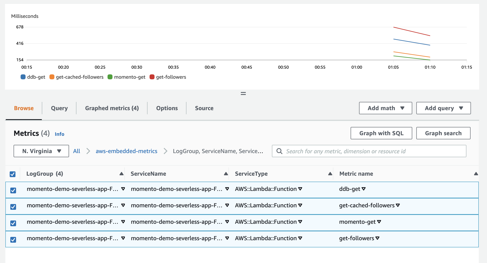

# Serverless Typescript API With Momento

This tutorial shows a basic serverless typescript REST api using DynamoDB supercharged with [Momento](https://www.gomomento.com/). It contains a 
Serverless Application that can be built and deployed with [SAM](https://docs.aws.amazon.com/serverless-application-model/latest/developerguide/what-is-sam.html) cli. The API is supposed to represent a basic `users` 
api. It contains the following endpoints:

```text
# Generates base users in DDB to use for test 
POST /bootstrap-users

# Get single user
GET /users?id=1
GET /cached-users?id=1

# Get passed users followers names
GET /followers?id=1
GET /cached-followers?id=1
```

#### POST /bootstrap-users
Bootstraps all the test user data needed. For this demo it generates
100 test users each following 50-60 random other test users.

#### GET /users & /cached-users
Makes either 1 call to DynamoDB or Momento
```text
$ curl https://x949ucadkh.execute-api.us-east-1.amazonaws.com/Prod/cached-users\?id\=2 -s | jq .
{
  "id": "2",
  "followers": [ "36", "4", "21", "21", "69", "69", "60", "48", "20", "35", "57", "51", "37", "75", "61", "48", "69", "28", "60", "30", "41", "79", "75", "46", "21", "51", "37", "52", "76", "62", "11", "38", "98", "10", "15", "90", "5", "97", "70", "44", "88", "31", "76", "97", "48", "15", "85", "64", "93", "5"],
  "name": "happy wombat"
}
```

##### GET /followers & /cached-followers
Will make 1 call to either DDB or Momento for passed user id and then N 
additional calls to either DDB or Momento to look up each follower name.
```text
$ curl https://x949ucadkh.execute-api.us-east-1.amazonaws.com/Prod/cached-followers\?id\=1 -s
["mystical hamster","relaxed cat","happy squirrel","goofy cat","goofy lion","sad rino","happy zebra","excited elephant","mystical dog","strange rabbit","sad sloth","sad rino","lazy sloth","dumb frog","strange lion","mystical otter","angry squirrel","angry squirrel","sad rino","clingy hamster","rare sloth","strange hamster","happy rino","happy sloth","excited rino","clingy frog","goofy elephant","mystical hamster","excited elephant","mystical zebra","excited rino","lazy frog","excited dog","rare sloth","clingy cat","excited dog","clingy rabbit","spacey rabbit","sad rino","clingy lion","rare sloth","goofy cat","spacey zebra","mystical otter","relaxed sloth","relaxed squirrel","lazy dog","lazy rabbit","happy rino","goofy lion","mystical zebra","angry hamster","rare sloth"]%
```
When deployed you will have an application that looks like this deployed into your account.


The lambda application will produce the following cloud watch metrics for you to compare in cloudwatch 
```text
ddb-get
momento-get

get-followers
get-cached-followers
```

## Pre-reqs
* [Docker](https://docs.docker.com/engine/install/)
* [AWS CLI](https://docs.aws.amazon.com/cli/latest/userguide/getting-started-install.html)
* [Local AWS Credentials](https://docs.aws.amazon.com/cli/latest/userguide/cli-configure-quickstart.html)
* [SAM CLI](https://docs.aws.amazon.com/serverless-application-model/latest/developerguide/serverless-sam-cli-install.html)
* [Momento CLI and AuthToken](https://github.com/momentohq/momento-cli#quick-start)

## Tutorial
1. Please clone this repo.
    1. `git clone git@github.com:momentohq/serverless-api-demo.git`
2. Change working directory to the repo you just cloned
    1. `cd serverless-api-demo`
3. Make sure you have your local AWS credentials configured. Please see [here](https://docs.aws.amazon.com/cli/latest/userguide/cli-configure-quickstart.html) for more info on getting started.
4. Update your Momento Auth token for `us-east-1` you received previously in [app.ts](https://github.com/momentohq/serverless-api-demo/blob/main/src/app.ts#L10) update `REPLACE_ME`.
   1. To get a new token run:
      `momento account signup aws --region us-east-1 --email my-email@demo.com`
5. Create a cache for demo with momento cli
   1. `momento configure --quick`
   2. `momento cache create --name momento-demo-users`
7. Build the project
    1. `sam build --beta-features`
8. Deploy the project into your AWS account
    1. `sam deploy --resolve-s3`
9. Get the URL of your new API from cfn output shown after `sam deploy` and set in env variable.
   1. ex: `export API_URL=https://x949ucadkh.execute-api.us-east-1.amazonaws.com/Prod`
      1. _Make sure to replace with your demo stack value `x949ucadkh` is just an example._
10. Bootstrap test users
    1. `curl -X POST "$API_URL/bootstrap-users"`
11. Start benchmark script
     1. `cd bench && ./start.sh`
12. Navigate to locust dashboard at http://0.0.0.0:8089/
    1. Start synthetic test with `20` users and spawn rate of `5`
    2. Make sure to enter host you got from output of `sam deploy`
13. Open AWS Cloudwatch Metrics service in your aws account and Look for [aws-embeded-metrics](https://us-east-1.console.aws.amazon.com/cloudwatch/home?region=us-east-1#metricsV2:graph=~();namespace=~'aws-embedded-metrics) under the 'custom' metric namespace
    1. _Be patient if metrics dont show up right away can take a minute at first._
14. Chart custom metrics to compare response times. 
    

